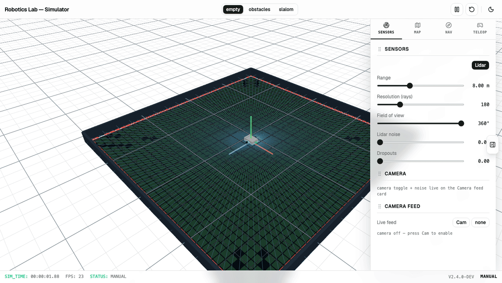

# Robotics Lab



> A browser-first robotics platform built with TypeScript, React and Three.js.

The goal of this repository is to learn robotics by building a collection of
simulation, planning and visualization applications that share a common set of
reusable packages. Every application runs in a browser whenever possible —
zero installation, live demos, fast iteration. Desktop runtimes (Electron /
Tauri) will only be introduced once native hardware access (ROS2, USB, Serial)
becomes necessary.

See [`docs/project.md`](./docs/project.md) for the philosophy and long-term
roadmap. The application plans live in
[`docs/simulator.md`](./docs/simulator.md) and
[`docs/drone-mission-planner.md`](./docs/drone-mission-planner.md).

---

## Repository layout

```
robotics-lab/
  apps/
    simulator/          differential-drive robotics playground (React Three Fiber)
    drone-mission-planner/
                        3D planning and simulation for autonomous drone missions
  packages/
    core/               shared types
    drone/              framework-independent drone dynamics and mission logic
    geometry/           geometry primitives
    maps/               JSON world format, loader, serializer
    noise/              deterministic sensor / motion noise
    robot/              pose, velocity, differential-drive kinematics
    sensors/            lidar + camera models (framework independent)
    occupancy-grid/     probabilistic mapping from scans
    navigation/         goal control, A* path planning, coverage
    rendering/          reusable R3F components + the E2E renderer bridge
```

Applications compose packages. Packages never depend on applications. The
simulation itself is deterministic and framework independent (no React, no
Zustand, no browser APIs), so it runs identically in the browser, in Node and
in tests.

## Applications

### [Robot Simulator](./apps/simulator)

A differential-drive robotics playground with lidar, occupancy-grid mapping,
A* navigation, coverage planning, localization, editing and playback.

### [Drone Mission Planner](./apps/drone-mission-planner)

A WebGPU-powered 3D planner for composing, validating, simulating and saving
autonomous drone missions. It includes manual flight, virtual lidar/GPS/IMU,
multiple camera modes, route execution and versioned JSON persistence. See the
[full development plan](./docs/drone-mission-planner.md).

---

## Stack

| Concern       | Choice                                       |
| ------------- | -------------------------------------------- |
| Runtime       | pnpm workspaces (`apps/*`, `packages/*`)      |
| Frontend      | React + TypeScript + Vite                    |
| Rendering     | Three.js, React Three Fiber, Drei            |
| UI / HUD      | Tailwind, shadcn                              |
| App state     | Zustand (UI only — never simulation state)    |
| Testing       | Vitest (algorithms) + Playwright (browser)    |
| Lint / format | Biome                                          |

---

## Getting started

Prerequisites: Node, pnpm, and a current browser with WebGL (simulator) or
WebGPU (drone mission planner).

```sh
pnpm install
```

Run the simulator app in dev:

```sh
pnpm -C apps/simulator dev
```

Run the drone mission planner (requires WebGPU):

```sh
pnpm -C apps/drone-mission-planner dev
```

Build it:

```sh
pnpm -C apps/simulator build
pnpm -C apps/drone-mission-planner build
```

### Testing

```sh
pnpm test                  # unit tests (Vitest)
pnpm -C apps/simulator test:e2e   # Playwright against the preview build
pnpm test:e2e:soak                # long-running stability / leak suites
```

The Playwright suite drives the simulator only through its public UI
(keyboard, mouse, HUD controls) and expresses clicks in *world coordinates*
via a renderer bridge shipped in the production build — see
[`docs/e2e.md`](./docs/e2e.md) and
[`docs/e2e-world-click.md`](./docs/e2e-world-click.md).

---

## Regenerating the README header

The animated GIF at the top of this file is produced by capturing screenshots
of the running simulator with Playwright and assembling them with ffmpeg:

```sh
scripts/build-readme-header.sh
```

It writes `docs/readme-header.gif`. See the script header for the available
knobs (`WIDTH`, `E2E_FRAME_COUNT`, `E2E_FRAME_MS`, `FRAMERATE`). The simulator
README shares this GIF; the drone mission planner has its own static capture
and regeneration instructions in its app README.

---

## Roadmap

The [simulator](./apps/simulator) established the shared packages, and the
[drone mission planner](./apps/drone-mission-planner) now applies them to
aerial robotics. Long-term targets:

- **Robot Simulator** — in progress (world, teleop, sensors, mapping,
  A* navigation, coverage, localization, editor, playback)
- **Drone Mission Planner** — in progress (3D editing, validation, execution,
  sensors and persistence implemented; external formats and replay next)
- **Visual SLAM Demo**
- **ROS2 Browser Visualization** (and a ROS bridge package)

Every application contributes reusable pieces back into the shared packages so
the next one starts on a stronger foundation.
