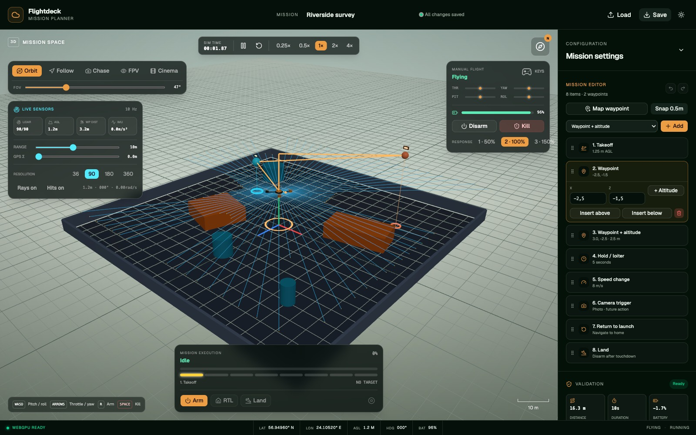

# Drone Mission Planner



> A browser-first 3D mission planner for building, validating, simulating and
> saving autonomous drone routes.

The app turns aerial robotics concepts into an interactive workflow: assemble
a mission from takeoff, waypoint, hold, speed, return-to-launch and landing
commands; inspect the route in 3D; validate it; then fly it with the built-in
deterministic simulation. It also supports manual flight and virtual sensors,
so a mission can be explored before it is executed.

See [`../../docs/drone-mission-planner.md`](../../docs/drone-mission-planner.md)
for the milestone-by-milestone plan and
[`../../docs/project.md`](../../docs/project.md) for the repository-wide
architecture.

---

## What it does

| Area | Capability |
| --- | --- |
| Mission editor | Add, edit, reorder, move and delete mission items; undo and redo changes |
| Mission commands | Takeoff, waypoint, hold, speed change, return to launch and land |
| 3D planning | Custom environments, route visualization, altitude snapping and draggable waypoints |
| Validation | Checks command order, bounds, route distance, battery feasibility and map collisions |
| Execution | Arm, take off, follow the route, hold, pause, resume, return home and land |
| Drone simulation | Fixed-timestep kinematics, simplified forces, battery and flight-state model |
| Manual flight | Keyboard and gamepad input, arm/disarm and emergency stop |
| Sensors | 360° lidar, altimeter, GPS and IMU readings with configurable visualization |
| Cameras | Orbit, follow, chase, first-person and cinematic views |
| Persistence | Versioned JSON save/load, recent missions and three built-in examples |

QGroundControl/MAVLink interchange, telemetry charts, mission replay and the
final visual-polish milestones are still in progress.

---

## Architecture

Mission logic, validation, persistence, drone physics and sensors remain
framework independent. React owns the application shell and UI state; React
Three Fiber visualizes snapshots of the simulation. The fixed-timestep loop is
decoupled from rendering so the same logic can run in the browser, Node and
tests.

The planner reuses the workspace's `core`, `math`, `geometry`, `maps`,
`sensors` and `rendering` packages and adds the framework-independent `drone`
package for aerial dynamics and mission logic.

---

## Run

WebGPU is required. From the repository root:

```sh
pnpm install
pnpm -C apps/drone-mission-planner dev   # http://localhost:8081
```

Build and test it with:

```sh
pnpm -C apps/drone-mission-planner build
pnpm -C apps/drone-mission-planner test
pnpm -C apps/drone-mission-planner typecheck
```

---

## Controls

| Action | Input |
| --- | --- |
| Pitch / roll manually | `W` / `S` pitch, `A` / `D` roll |
| Throttle / yaw manually | Arrow up/down throttle, arrow left/right yaw |
| Emergency stop | `Space` |
| Add a waypoint | Select add-waypoint mode, then click the mission space |
| Move a waypoint | Drag it in the mission space |
| Orbit / pan / zoom | Pointer controls in orbit camera mode |
| Execute a mission | Use the mission controls over the 3D viewport |

Mission editing, validation, vehicle settings and route statistics live in the
right-hand panel. Camera, sensor and manual-flight controls are overlaid on the
mission space.

---

## Regenerating the screenshot

The README image is a deterministic browser capture of the production build.
The script launches the app with Chrome's WebGPU support enabled and writes a
JPEG back to this directory. Run `pnpm install` at the repository root first
so the workspace's Playwright tooling is available:

```sh
node scripts/capture-drone-mission-planner.mjs
```

Override the output or capture dimensions when needed:

```sh
OUTPUT=docs/drone-planner.jpg WIDTH=1600 HEIGHT=1000 \
  node scripts/capture-drone-mission-planner.mjs
```
