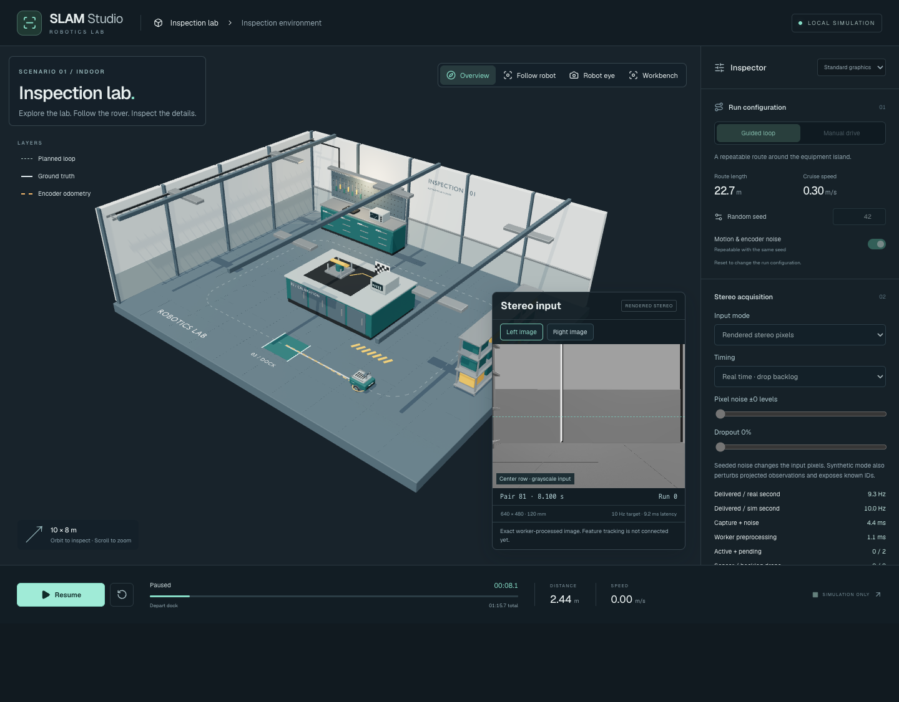

# SLAM Studio

A browser-first visual SLAM explorer. **Phases 1–3 implement motion, authored graphics and stereo acquisition:** a deterministic differential-drive rover, inspection route, manual control, collision handling and encoder-odometry comparison. Calibrated stereo capture and grayscale preprocessing run in a worker. Feature tracking and visual SLAM are not connected yet.



From the repository root:

```sh
pnpm install
pnpm dev:slam           # http://127.0.0.1:8082
pnpm build:slam
pnpm -C apps/slam-demo typecheck
pnpm -C apps/slam-demo test
pnpm test:e2e:slam      # builds and tests a separate preview on port 4182
```

The dedicated Playwright configuration uses locally installed Google Chrome (`channel: 'chrome'`). The graphical app requires WebGL2. Tests drive public controls and never mutate simulation state.

Choose **Guided loop**, then **Run inspection** for the 22.7 m / 75.7 s inspection. **Pause**, **Resume** and **Reset** control simulation time. Reset preserves the selected seed, mode and noise setting; it clears motion, trails, odometry and elapsed time. Change seed/noise/mode before starting or after resetting.

For manual control, choose **Manual drive**, then **Start drive**. Use WASD, arrow keys, or hold the on-screen direction buttons. The maximum linear command is 0.45 m/s and turn command is 1.2 rad/s. Space pauses a running session; moving focus into an editable field suspends keyboard shortcuts. Switching tabs or moving focus outside the window pauses the run. The inspector scrolls independently on desktop; smaller screens place it below the scene.

Use **Overview** to orbit/zoom, **Follow robot** for a moving camera, **Robot eye** for the left camera mount’s presentation view, and **Workbench** for a material close-up. Choose standard or low graphics in the inspector. Assets load before driving is enabled; failed loads show recovery guidance. The layer buttons independently show the planned loop, ground truth and encoder odometry. The amber ring marks the encoder position. The stereo panel shows real processed images; the visual estimator remains explicitly inactive.

Architecture:

- `src/sim/simulation.ts`: pure fixed-step transitions using shared robot kinematics, odometry and seeded noise.
- `src/sim/route.ts`: timed straight/arc commands; no UI or renderer inputs.
- `src/sim/world.ts`: canonical world geometry, circle-versus-box collision checks and scene conversion.
- `src/sim/controller.ts`: private simulation ownership, fixed-step accumulator, commands and snapshots. React observes through `useSyncExternalStore`.
- `src/store.ts`: Zustand holds only camera/layer/quality preferences. No truth, odometry, estimator state or clock lives there.
- `src/components/scene.tsx`: authored GLB environment, cameras and WebGL2 views of simulation state.

The world uses meters and canonical X/Y ground coordinates, Z up; rendering maps `(x,y,z)` to `(x,z,-y)`. The generic shared planar kinematics run directly in this canonical frame. No legacy map poses cross this boundary.

See the [implementation plan](../../docs/slam-demo.md), [Phase 0 decisions](../../docs/slam-demo/phase0/README.md), and [Phase 1 review](../../docs/slam-demo/phase1/README.md).

Regenerate the review screenshots while the dev app is running:

```sh
node scripts/capture-slam-demo.mjs
```

Phase 2 sources, export instructions and licenses are in [assets/slam-demo](../../assets/slam-demo/README.md). See the [Phase 2 review](../../docs/slam-demo/phase2/README.md) for screenshots, budget measurements and asset validation. Robot eye remains a presentation camera; sensor capture uses independent calibrated cameras.

Phase 3 adds **Stereo acquisition** settings: rendered pixels or synthetic oracle observations, real-time or lockstep timing, seeded pixel noise and dropout. Use **Left image / Right image** to inspect the exact processed pair. **Save last 6 pairs** exports a bounded pixel fixture; **Replay pixels** processes it without rendering. See the [Phase 3 review](../../docs/slam-demo/phase3/README.md) for tests, ownership/timing contracts, GPU calibration evidence and offline replay instructions.
