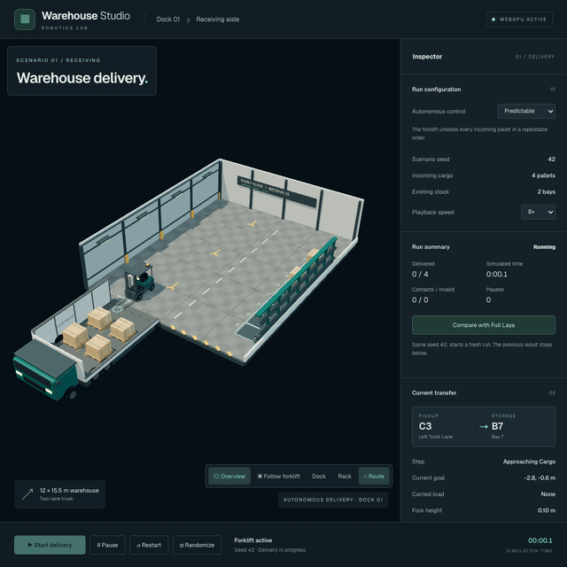

# Warehouse Demo

Autonomous warehouse delivery through Phase 6. It renders authored Blender assets with Three.js WebGPU through React Three Fiber v10 alpha and Drei v11 alpha. The **Predictable** controller unloads every incoming pallet into an empty bay, with visible pickup, lift, carry and lowering. **Full Laya** chooses cargo, bays and discrete motor commands through the local model, with visible decisions and bounded failure pauses.

Run `pnpm -C apps/warehouse-demo dev` and open the local URL. A WebGPU-capable browser and device are required. The page confirms the active WebGPU backend and explains when it is unavailable.

Use **Start delivery** to watch the full run, **Pause** to stop it, **Restart** to replay the same seed, and **Randomize** to generate new cargo positions and existing stock. Choose **Predictable** or **Full Laya** under Autonomous control; changing mode resets the same seed. Predictable simulation offers 1×, 4× and 8×. Live Full Laya runs at 1× to preserve decision timing. Overview, follow, dock and rack buttons change the camera; Route toggles the current goal cue. There are no manual driving controls. The inspector shows the selected cargo and bay, current step and goal, carried load, progress, contact/invalid counts, and recent events.

**Run summary** shows delivered cargo, simulated time, contacts, invalid actions, pauses and outcome. **Compare with the other mode** restores the same seed and retains the previous result. **Replay recorded Laya run** plays the recorded world states and decisions without contacting the model, at 1×, 4× or 8×. Recordings remain in this tab until replaced or reloaded; restarting starts a fresh simulation. Reduced-motion preferences disable Follow and camera damping. See the [Phase 5 review](../../docs/warehouse-demo/phase5/README.md) for playback, mobile and lifecycle evidence.

The fixed-step world, seeded generator, route graph, task selector and motion controller live in `src/sim`; the scene reads world snapshots. Run `pnpm -C apps/warehouse-demo test` for simulation checks, `pnpm -C apps/warehouse-demo test:e2e` for browser checks, and `pnpm -C apps/warehouse-demo build` for the production bundle. All new tests use standalone `test(...)` functions.

The separate Phase 0 renderer probe remains available through `pnpm -C apps/warehouse-demo dev:probe` at `/probe.html`.

See [the asset workflow](../../assets/warehouse-demo/README.md) for the editable Blender source, repeatable MCP/background export, manifest and GLB checks. Browser captures and production performance measurements are in the [Phase 3 review](../../docs/warehouse-demo/phase3/README.md).

## Full Laya setup

Keep your Laya server running at `http://127.0.0.1:8000/v1/systemone`. The Vite dev/preview proxy forwards `/api/laya/v1/systemone` to it. Set `LAYA_ORIGIN` to change the proxy origin; set `VITE_LAYA_ENDPOINT` to explicitly configure a browser endpoint. Static hosting needs a reachable endpoint or a same-origin proxy. Predictable mode works without the service.

The [Phase 4 review](../../docs/warehouse-demo/phase4/README.md) documents the control boundary, prompt measurements, reference-seed comparison, browser evidence and failure limits. Run `node scripts/warehouse-phase4/compare.mjs` from the repository root for the live comparison. This sends real local-model requests; run it separately from other live measurements.

## Capture and share

With the app running locally, run `pnpm screenshots:warehouse` from the repository root. It captures four current WebGPU views—[overview](screenshots/overview.png), [dock pickup](screenshots/dock-pickup.png), [follow forklift](screenshots/follow-forklift.png), and [rack placement](screenshots/rack-placement.png)—plus this README GIF and a [short square MP4 for X](media/x-preview.mp4). Run `pnpm video:warehouse:x` to update just the video and GIF from a fresh complete Predictable delivery. Requires local Chrome and ffmpeg. `WAREHOUSE_URL` overrides the capture URL.

See the [Phase 6 review](../../docs/warehouse-demo/phase6/README.md) for production-browser verification, test results and release limits.
