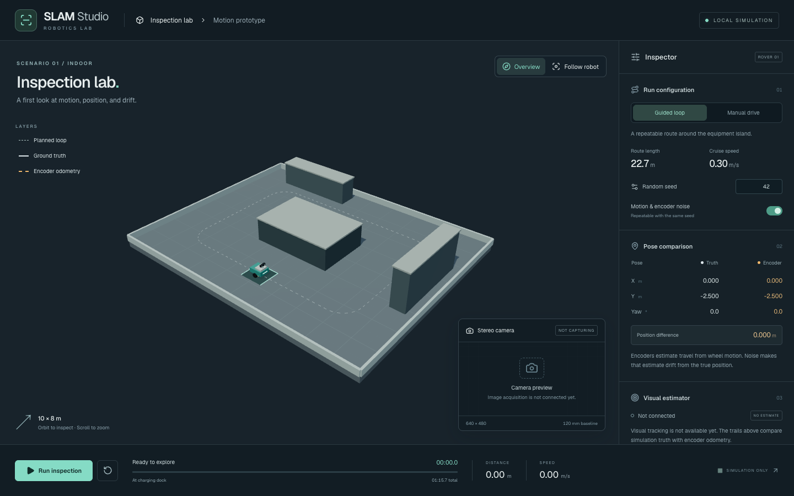

# Phase 1 — app shell and deterministic motion

Phase 1 implements the simulation foundation in `apps/slam-demo`. The visual SLAM pipeline and Blender-authored environment remain later phases.

Review the app at **http://127.0.0.1:8082** after running `pnpm dev:slam` from the repository root.

## Implemented behavior

The WebGL2 viewport contains a 10×8 m collision world, an equipment island, workbench and storage placeholders, and a rover with visible stereo mounts. The dark application shell follows the Phase 0 visual direction: inspector, scene layers, camera-feed slot and persistent playback/status strip. The camera slot says **Not capturing**, and the visual estimator has a separate snapshot with `pose: null` and status `not-connected`.

The guided route travels 22.712 m around the island at 0.30 m/s, with 0.75 m corner radii and a 0.40 rad/s turn rate. It completes after 75.708 simulated seconds and stops. This initial motion model starts/stops immediately; acceleration ramps are not implemented. The controller splits a fixed step at command boundaries to avoid rounding the corner durations to whole frames.

Manual mode supports forward/reverse and differential-drive turns through WASD, arrow keys and pointer/keyboard-accessible buttons. Space pauses a running session. Leaving the window or hiding the tab pauses the session and clears input. Pause/resume never consume simulation time or RNG steps. Reset restores the configured seed and spawn and clears both trails.

Collision uses a conservative 0.31 m circular rover footprint against world bounds and the visible obstacle rectangles. Contact stalls motion and reported wheel travel. Manual mode can reverse away; unexpected contact during the guided route pauses the run. This is a lightweight contact model, not rigid-body physics.

Motion noise uses the shared seeded RNG and 2.5% wheel-speed perturbations. Encoder odometry independently integrates reported wheel commands with a documented ±0.6% calibration bias when noise is enabled. It does not read the truth pose. With noise disabled, the baseline and truth follow the same commanded motion. Truth is visible by default in this motion-comparison milestone; its layer can be hidden.

## Ownership and timing

The pure simulation owns truth, odometry, a separate inactive estimator snapshot and bounded histories. The controller owns the current immutable state and a 1/60 s accumulator; React reads published snapshots at about 10 Hz, while the rover renderer reads current poses each frame. Zustand owns only camera mode and layer visibility.

A single animation callback contributes at most 100 ms of wall time, so a stalled or suspended tab does not cause a large catch-up step through obstacles. The deterministic contract is the same seed/configuration and commands at the same fixed ticks, not equal wall-clock duration on overloaded machines. Each history is capped at 1,800 samples. Canonical coordinates match the Phase 0 convention; no legacy planar-map reflection is applied to newly authored canonical geometry.

## Verification

- 8 app unit tests cover closed-loop completion, seeded repeatability, seed differences, encoder divergence, boundary and island collisions, reverse recovery, pause/resume equivalence, cadence independence, input reset and bounded catch-up.
- 45 relevant unit tests pass across the app and reused robot/noise packages.
- 3 Playwright tests exercise guided start/pause/resume/reset, camera-follow selection, manual keyboard motion/release, and a narrow-screen layout through public UI.
- App TypeScript, Biome checks and the production build pass.
- Desktop, paused-run and mobile screenshots were inspected; no browser page errors occurred during capture.

The build reports the normal large-chunk advisory for the current Three.js bundle. No production asset or performance budget is claimed at this milestone. Existing package implementations and dependency versions were preserved; the lockfile change adds the new workspace importer.

## Review suggestions

Run the inspection with seed 42 and noise enabled, then watch the amber encoder trail separate from the light ground-truth trail. Pause and resume, switch to Follow robot, and reset. Disable noise for a fresh run to compare coincident estimates. Reset again, select Manual drive, then drive toward a boundary and reverse away. On a phone-sized viewport, the inspector is below the scene and transport stays reachable.

[Paused run](running.png) · [Mobile layout](mobile.png) · [Application instructions](../../../apps/slam-demo/README.md)

Stopped after Phase 1. Phase 2 modeling/export work has not started.
