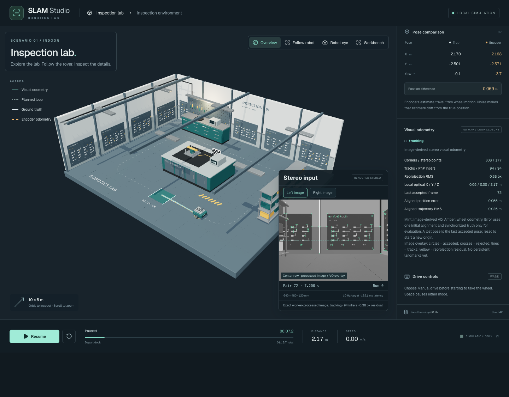

# Phase 4 — Stereo visual odometry

Phase 4 implements image-derived stereo visual odometry. Mapping, loop closure and relocalization remain later phases. Stop here for user review.



## Implementation

`packages/vision` accepts calibrated grayscale RGBA pixels and an injected OpenCV facade. It has no Three.js, DOM, simulator, encoder or landmark-ID dependencies. The classic browser worker loads the locally vendored, SHA-256-verified OpenCV.js 4.13.0 artifact selected in Phase 0. Development and production builds generate its worker bundle; no runtime CDN is required. Attribution, license and provenance accompany the artifact in `public/vision`.

The frontend selects at most 480 GFTT corners with an 8×6 coverage grid and per-cell limits. Forward/backward pyramidal LK tracks stereo and temporal correspondences. Normalized 7×7 image patches reject inconsistent appearances and ambiguous epipolar alternatives. Rectified triangulation requires positive, conditioned disparity and depth; the estimator receives neither world landmarks nor known synthetic correspondences.

RANSAC PnP estimates reference-to-current camera motion from stereo 3D points and current image observations. Iterative refinement uses its inliers. Accepted motion requires at least eight inliers, 35% support, three occupied grid cells, reprojection RMS ≤2 px and bounded translation/rotation per elapsed second. Stronger support produces `tracking`; weak accepted support or temporary failures produce `degraded`. Initialization needs 16 stereo points across four cells. Five failures or an input gap beyond one second causes terminal `lost`. A failed estimate preserves the last accepted pose and frame ID; reset establishes a new origin. There is no fabricated recovery.

Persistent grayscale Mats are reused. Temporary native objects are deleted in `finally`; disposal releases the persistent Mats, and generation reset terminates the worker. The inherited queue stays at one active plus one latest pending pair, recordings at six pairs, feature arrays at 480 and displayed trajectory at 1,200 positions. The route retained exactly three native Mats between every frame, with a peak of 29. These are application-owned object counts, not a measurement of total browser/GPU memory.

The left camera displays synchronized accepted circles, rejected crosses, temporal tracks and yellow reprojection residuals over the exact processed pixels. The mint visual trajectory has its own layer toggle alongside truth and amber encoder odometry. The inspector reports support, residuals, local optical XYZ, status and last accepted frame. Optical coordinates are right/down/forward relative to the first accepted camera. The evaluator performs one initial pose alignment and uses timestamp-matched truth solely for error reporting and drawing; it never feeds the estimator. Replayed pixels produce local VO without invented world-error metrics. Synthetic input, including recorded oracle observations, explicitly disables VO.

## Authored graphics update

The first full-route experiment lost visual support near a largely blank wall. The Blender source now includes physical service-panel labels and wiring diagrams around the lab at camera height. These surfaces appear in both presentation and stereo rendering. Their seeded patterns provide natural image features; their IDs or geometry never enter the worker.

Rebuilt `.blend` and GLB files accompany the reproducible additions in `scripts/slam-assets/build.py`. Calibration mounts, route and collision manifest remain unchanged. The export script updates its existing [asset report](../phase2/asset-export.json): lab 142,448 triangles / 1,010,584 bytes; cutaway 84,252 / 569,064 bytes; rover 7,140 / 246,540 bytes. Historical Phase 2 screenshots and performance measurements describe the earlier assets. `node scripts/slam-assets/validate.mjs` passes for the updated exports.

## Verification and measured limits

| Check | Result |
| --- | --- |
| App/shared package unit tests | 84 passed across 10 files |
| Production build and browser suite | 10 passed; public controls, overlays, reset, replay, loss and oracle isolation |
| App and vision TypeScript checks | Passed |
| Fixed native algorithm checks | Known motion, 25% outliers, pure rotation, low/negative disparity, epipolar mismatch, blank frames, insufficient corners and frozen lost pose passed |
| Five fixed rendered stereo pairs | Metric position error <1 cm on every frame |
| Full 22.712 m route, noise-free lockstep | 758 pairs: one initialization, 757 tracking, no lost/degraded frames |
| Once-aligned 3D position error | RMS 0.274 m; maximum 0.422 m; final 0.306 m |
| Worker processing, full route | Median 123.5 ms; p95 135.0 ms, excluding first initialization |
| Route wall time | 99.0 s for 75.7 s simulation time |
| Browser screenshot review | Chrome 152; no page errors |

The Phase 0 **30 ms/pair vision target is not met**. This milestone verifies bounded processing and image-derived tracking, not sustained real-time 10 Hz throughput. Real-time mode drops superseded pending pairs and displays backlog/rate/latency; lockstep preserves all input frames by slowing simulation. Performance optimization remains necessary. The full-route accuracy result is one noise-free rendered fixture, not a claim about all seeds, manual trajectories or adverse visual conditions. Accumulated drift remains visible because no mapping or loop correction exists.

Evidence: [fixed algorithm checks](algorithm-checks.json), [complete per-frame route measurements](route.json), [browser review](browser-review.json), [feature overlay](features.png), [mobile layout](mobile.png).

## Reproduce

From the repository root, after installing workspace dependencies:

```sh
pnpm dev:slam
```

In another terminal:

```sh
node scripts/slam-vision/build.mjs
node_modules/.bin/esbuild scripts/slam-vision/verify.ts --bundle --platform=node --format=esm --outfile=.temp/slam-vision-verify.mjs
node .temp/slam-vision-verify.mjs
node scripts/slam-vision/route.mjs
node scripts/slam-vision/review.mjs
node_modules/.bin/vitest run apps/slam-demo/src packages/vision packages/sensors packages/robot packages/noise
pnpm test:e2e:slam
```

The route runner captures through the same calibrated adapter and sends only image packets to the actual worker. Truth remains outside it for evaluation. Both browser runners use local Chrome and the dev server on port 8082. After editing vision/worker source during an existing dev session, rebuild the classic worker and reload the page. Dev startup and production builds do this automatically.

For manual review, run the guided loop, inspect the left-camera tracks and Visual odometry inspector, toggle the mint layer, then pause/reset. Replay a saved pixel window to see its independent local origin, or select synthetic mode to confirm that oracle observations are visibly excluded. Phase 5 is not started.
