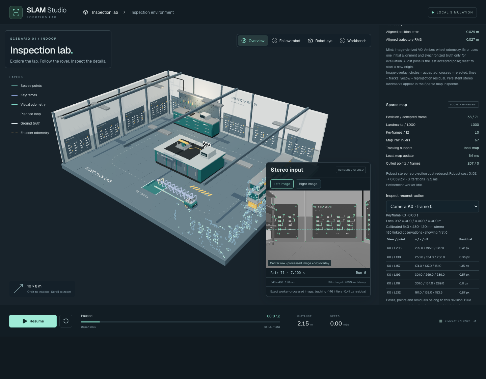

# Phase 5 — Keyframes and persistent sparse mapping

Phase 5 adds a bounded local stereo map, map-supported tracking and local bundle adjustment. Loop closure, global optimization and relocalization remain later phases. Stop here for user review.



## Implementation

The image frontend supplies accepted stereo samples and normalized 7×7 intensity descriptors. Landmarks receive estimator-owned monotonic IDs; neither world geometry nor simulator IDs enter the estimator. Every retained observation links a landmark to a calibrated keyframe with measured left `(u,v)` and right `u` coordinates.

Keyframes are selected by translation over 0.2 m, rotation over 0.12 rad, overlap below 35%, weak tracking, or a two-second refresh interval. Selection has a minimum half-second interval. The local map projects existing landmarks into the current stereo image, requires spatial proximity, descriptor agreement, an ambiguity ratio and consistent metric depth, then solves robust PnP against those persistent 3D points. It retains the stereo-odometry proposal when map support fails its gates. This is local tracking with a valid motion proposal, not global relocalization after loss.

New stereo points are triangulated by the existing conditioned frontend. Matched observations attach to existing landmarks; nearby points fuse only with matching appearance and depth. Weak old points, inconsistent observations, orphan points and redundant interior keyframes are removed. Hard caps retain at most **1,000 landmarks and 12 keyframes**, including the initial reference camera. Observation links are removed with their keyframes. Quality reflects repeat visual support. This is a bounded active map rather than an indefinitely retained reconstruction of the entire route.

Local bundle adjustment alternates damped Gauss–Newton updates of 3D points and six-degree camera poses. Its objective uses Huber-weighted stereo reprojection residuals `(uL,vL,uR)`. Stereo baseline fixes metric scale; the oldest pose in each local window remains fixed, and the initial reference pose never changes. Each job has at most **four cameras, 120 shared points and three iterations**. Singular blocks, invalid depth, excessive updates and non-improving proposals are rejected. A commit must also avoid increasing the robust cost across retained boundary observations outside the optimized subset.

Optimization runs in a separate worker with at most one job outstanding. Tracking continues without awaiting it. A result for a superseded keyframe graph is rejected; an accepted result corrects the subsequent camera proposal and is published atomically with the map on the next accepted frame. The packet includes a monotonic revision, accepted frame ID, current pose, keyframe poses, points, observations, culling counts and refinement report. Old published snapshots never mutate. Lost tracking freezes the last accepted pose and map; reset terminates the worker generation and starts new IDs and revision counters.

`packages/vision` remains independent of the browser, renderer and simulator. The browser supplies an asynchronous bundle scheduler; fixed Node fixtures use the same solver synchronously. Both generated worker bundles are built by the existing dev/build commands and ignored by Git.

## Inspecting the result

The scene uses one instanced mesh for sparse points and calibrated camera frusta for retained keyframes. Points and frusta are selectable by mouse; **Inspect reconstruction** provides equivalent keyboard selection. The inspector shows local coordinates, support score, calibration, observation links, measured image coordinates and residuals computed from that same map revision. Independent **Sparse points** and **Keyframes** buttons control their visibility.

Mint points have stronger repeat support; blue-gray points have weaker support. The initial truth alignment is used only to place the local reconstruction in the displayed lab and report errors. It is not sent to either estimator worker. Replays reconstruct their own local map without fabricated world placement. Synthetic oracle inputs produce no map. The streamed visual trajectory records accepted estimates; the map's retained camera frusta show its current refined poses.

A recording regression was fixed during verification: raw pixel fixtures now explicitly serialize sensor inputs and an optional checksum, excluding estimator/map snapshots. This keeps recording headers bounded and ensures replay reconstructs its own map. Recordings still contain at most six stereo pairs.

## Verification

- Controlled fixtures cover reduced robust reprojection error, a fixed reference camera, outliers, singular geometry, invalid depth, stable IDs, fusion, linked observations, map caps and immutable snapshots.
- Deferred-job tests cover coherent publication, one outstanding job and stale graph rejection.
- Native OpenCV checks use the fixed rendered Phase 0 pixels to verify persistent IDs, local-map PnP, coherent pose/map revisions, frozen loss, reset and explicit disposal. See [algorithm checks](algorithm-checks.json).
- Browser tests exercise map growth, map support, selectable real observations, layer toggles, reset, oracle isolation and recorded pixel replay, alongside all earlier-phase checks.
- The full rendered route runs through the calibrated capture adapter and real workers. Its truth poses are used only by the external evaluator. See [per-frame measurements and final map](route.json).

| Check | Result |
| --- | --- |
| Unit tests | 91 passed across 11 files |
| App and vision TypeScript / Biome | Passed |
| Production build and browser suite | 11 passed |
| Fixed rendered-pixel native checks | Passed; persistent IDs, local map tracking, loss, reset and disposal |
| Full 22.712 m route, noise-free lockstep | 758 pairs: one initialization, 757 tracking, no degraded/lost frames |
| Frames with accepted local-map PnP | 745 |
| Once-aligned 3D trajectory error | RMS 0.082 m; maximum 0.170 m; final 0.054 m |
| Local map update, median / p95 | 7.1 / 17.1 ms (20 ms target) |
| Separate refinement jobs, median / p95 | 9.4 / 14.1 ms |
| Refinement transactions | 94 accepted; 28 rejected because boundary observations worsened |
| Total tracking-worker processing, median / p95 | 129.1 / 144.1 ms |
| Route wall time | 106.9 s for 75.7 s simulated motion |
| Map bounds | At most 1,000 points / 12 keyframes throughout |
| Native Mat ownership | Three persistent, peak 39; zero after explicit disposal in native fixture |

See the [measurement summary](route-summary.json), [browser review](browser-review.json), [feature overlay](features.png) and [mobile layout](mobile.png).

The local mapping budget is met at p95 in this measured session. **The inherited 30 ms vision target and sustained real-time 10 Hz throughput are still unmet.** The queue remains bounded and real-time mode reports dropped superseded frames; lockstep preserves every image pair by slowing simulation. Total browser/GPU memory has not been profiled; object counts and hard map caps are not substitutes for that measurement.

This is one Chrome 152 session and one noise-free route. The earlier Phase 4 fixture measured 0.274 m RMS. The lower error here demonstrates this particular combined map-tracking/refinement run; it is not an isolated solver ablation or a guarantee across seeds and visual conditions. Asynchronous optimization availability can change which frame commits a result, so exact trajectory values need not be bitwise identical between runs. Fixed pure/native tests use a deterministic synchronous scheduler. No loop closure was performed.

## Reproduce

Start the app from the repository root:

```sh
pnpm dev:slam
```

In another terminal:

```sh
node scripts/slam-vision/build.mjs
node_modules/.bin/esbuild scripts/slam-mapping/verify.ts --bundle --platform=node --format=esm --outfile=.temp/slam-mapping-verify.mjs
node .temp/slam-mapping-verify.mjs
node scripts/slam-mapping/route.mjs
node scripts/slam-mapping/review.mjs
node_modules/.bin/vitest run apps/slam-demo/src packages/vision packages/sensors packages/robot packages/noise
pnpm test:e2e:slam
```

Browser runners use locally installed Chrome and port 8082. Avoid editing imported source while collecting a route, since Vite hot reload restarts the harness. Rebuild both workers after worker/vision edits during an existing dev session; normal dev startup and production build do this automatically.

For manual review, run the guided loop, pause, scroll to **Sparse map**, and select a point or camera. Inspect its linked observations and residuals, toggle the two map layers, then reset to verify the new origin. No Blender changes are required for Phase 5.
