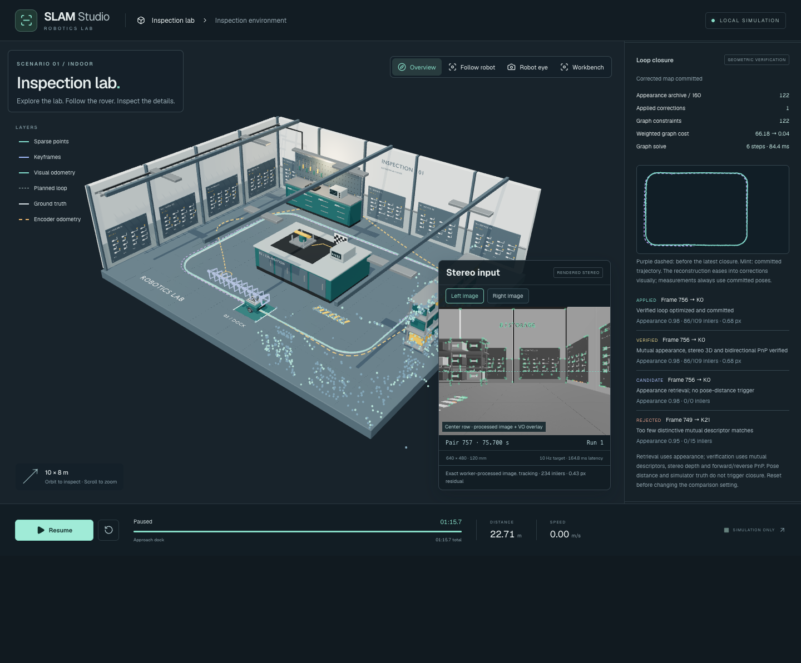

# Phase 6 — Verified loop closure

Phase 6 adds image-based place retrieval, geometric loop verification, a bounded SE(3) pose graph and coherent correction of the map and tracking state. Implementation and verification are complete; this phase is ready for user review. Relocalization after tracking loss remains Phase 7.



## What changes

The local map still retains at most 12 keyframes and 1,000 landmarks. A separate appearance archive retains at most 160 keyframes, each with at most 240 stereo observations and normalized wider image-patch descriptors. A 64-bin appearance signature ranks candidate places; the top three eligible candidates are verified. Candidates must be at least 20 seconds and 25 keyframe IDs older. Pose distance, world geometry, simulator landmark IDs and truth proximity are not retrieval inputs.

Mutual descriptor matches pass a ratio test before robust PnP. Verification requires forward and reverse geometric fits, agreement of the composed transforms, stereo 3D consistency, spatial coverage and nonplanar depth support. At least 18 matches must survive with 65% support; a single verification needs 48 inliers to submit a loop immediately. Weaker verified evidence requires a second consistent older candidate. For three seconds after verification, the mapper requests follow-up keyframes at its existing half-second minimum even when local overlap remains high. This prevents a short revisit from ending before another observation can confirm it. Similar appearance alone emits a rejected event and never adds a constraint.

An anchored SE(3) graph stores odometry and verified loop constraints, capped at eight loop edges. Its six-dimensional residual uses relative translation and a stable rotation logarithm. Huber weighting, damping, matrix-free preconditioned conjugate gradients, at most six nonlinear iterations and 100 linear steps bound the solve. The first pose is fixed. A finite, improving graph result is required before publication. The numerical formulation follows the standard relative-pose graph structure described in the [Ceres 3D pose-graph example](https://github.com/ceres-solver/ceres-solver/blob/master/examples/slam/pose_graph_3d/README.md); this implementation uses its own TypeScript solver, not Ceres.

Graph correction runs in a separate worker. The commit moves active keyframes and landmarks through their observing camera transforms, fuses matching corrected duplicates, rewrites observation links and corrects the ongoing tracking anchor. It invalidates stale local optimization jobs and schedules local stereo refinement. Archived camera poses and bounded pose history are corrected in the same transaction. A superseded graph result is rejected. Archive eviction preserves the initial anchor and loop endpoints, composes adjacent odometry constraints and reattaches retained trajectory samples.

Each result is a coherent map revision. Completed corrections can publish against the last accepted image frame while paused or finished; this does not manufacture a new sensor exposure or increment the delivered-frame count. Generation and frame checks reject stale updates. The evaluator replaces the last sample instead of double-counting it. Loss still freezes the last accepted state and requires reset; this phase does not implement recovery.

## Visible behavior

The **Loop closure** setting enables verified closure or keeps local mapping as the comparison baseline; changing it resets the run. Synthetic observations remain explicitly excluded.

The **Loop closure** inspector distinguishes candidate, verified, rejected and applied events. It shows the appearance score, match/inlier counts, geometric residual, graph cost before/after, solve time and bounded database size. The purple dashed path shows the trajectory before the latest closure; mint shows the committed corrected trajectory.

Sparse points and retained camera frusta ease into corrections over 650 ms in a display-only copy. The estimator, error calculations and inspector always use committed values. The animation never feeds back into geometry or optimization. Old snapshots remain immutable.

Pixel recordings continue to serialize only sensor inputs. Concurrent dev and test builds now publish complete worker bundles atomically and syntax-check them before replacement, avoiding partially written worker scripts.

## Verification

The focused unit suite passes **102 tests across 15 files**. Workspace TypeScript checks, the Phase 6 Biome checks and the production build pass. All **13 production-browser tests pass**, including the complete rendered revisit with asynchronous graph correction, before/after paths, residuals and reset. [Native geometry checks](geometry-checks.json) recover the true metric transform, reject the matching-appearance false place and planar ambiguity, and release every tracked native allocation.

Verification caught a short-revisit regression: seed 7 with pixel noise 4 produced a valid 46-inlier hypothesis but ended before enough follow-up keyframes could confirm it. The bounded confirmation-keyframe request fixes this without relaxing verification thresholds. The isolated rerun accepted 135 inliers and reduced once-aligned RMS from 0.164 m to 0.033 m. See the [before/after regression evidence](confirmation-regression.json).

The comparison harness captures each stereo pair once, applies seeded pixel noise, then sends identical copies to enabled and disabled workers. Processed-image checksums must match for every pair. Both runs use the same initial truth alignment, with no trajectory fitting afterward. Truth remains outside both workers. The comparison measures final once-aligned trajectory RMS after graph corrections; streaming pre-correction errors are a different metric. Local and graph solvers run synchronously in these quantitative fixtures to remove worker scheduling as a confounder; the app uses independent optimization workers.

All three final paired fixtures pass in Chrome 153.0.8010.48. Each contains 758 stereo pairs, one applied closure, no tracking loss, and an identical 401-frame no-loop prefix with zero corrections. Every paired image checksum matches. The runner gates finite RMS improvement, complete trajectory coverage and the unchanged prefix.

| Seed / pixel noise | Closure off RMS | Closure on RMS | Reduction | Weighted graph cost before → after |
| --- | --- | --- | --- | --- |
| 42 / 0 | 0.137 m | 0.045 m | 67.5% | 81.609 → 0.119 |
| 7 / 4 | 0.161 m | 0.055 m | 65.8% | 97.013 → 0.065 |
| 99 / 8 | 0.135 m | 0.037 m | 72.4% | 73.512 → 0.054 |

Each graph solve uses six iterations and takes 82–85 ms in these fixtures. Final active maps contain 970–978 landmarks and 12 keyframes; appearance archives contain 123–126 entries, below their 160-entry cap. These timings describe the graph solve, not total frame processing. See the [measurement summary](comparison-summary.json) and [full paired trajectories, checksums and events](comparison.json). Earlier `route.json` and `comparison-42.json` are exploratory pre-completion captures; use `comparison.json` for the final acceptance results.

The first 40 seconds are also checked as a no-loop prefix. Controlled native fixtures verify a true relative transform, a visually matching but geometrically false candidate, and planar ambiguity. Pure tests cover anchored graph improvement, invalid constraints, temporal exclusion, bounded archives, staged events and presentation-only interpolation. Browser tests include a complete rendered revisit, correction publication, event/path inspection, reset and oracle isolation.

The final live browser capture accepts 86 of 109 correspondences at frame 756, with a 0.68 px geometric residual. Its asynchronous graph solve reduces weighted cost from 66.18 to 0.04 in six steps. No browser page errors were reported. The [event inspector](events.png), [mobile layout](mobile.png) and [browser review record](browser-review.json) show the committed result; both desktop and mobile screenshots were visually inspected.

The root-wide Vitest invocation additionally passed 329 tests in 44 files, but six suites in the simulator and drone planner could not load their app-specific `@/` aliases through the root test configuration. This is a separate configuration limitation; the focused SLAM suite and all workspace typechecks pass. No unrelated app configuration was changed.

The earlier 30 ms total-vision target remains unmet; Phase 6 does not claim to resolve that performance limit. Map/database caps bound retained estimator data, but total browser/GPU memory has not been profiled. Quantitative comparisons and browser checks run sequentially to limit concurrent browser workloads. These fixtures establish improvement on this route and these image-noise settings, not general relocalization or robustness to arbitrary scenes. GPU pixels and asynchronous worker commit timing can vary between sessions.

## Reproduce

From the repository root:

```sh
pnpm dev:slam
```

In another terminal:

```sh
node scripts/slam-vision/build.mjs
node_modules/.bin/esbuild scripts/slam-loop/verify.ts --bundle --platform=node --format=esm --outfile=.temp/slam-loop-verify.mjs
node .temp/slam-loop-verify.mjs
node scripts/slam-loop/compare.mjs
node scripts/slam-loop/review.mjs
node_modules/.bin/vitest run apps/slam-demo/src packages/vision packages/sensors packages/robot packages/noise --maxWorkers=1
pnpm test:e2e:slam
```

The browser runners use local Chrome and port 8082. The three full paired comparisons take several minutes. `LOOP_SEED=42 LOOP_NOISE=0 node scripts/slam-loop/compare.mjs` runs one fixture. The runners suppress Vite hot-reload messages so an ongoing measurement is not restarted by editor changes. Rebuild the workers before beginning a new measurement.

For manual review, choose lockstep timing, run the full guided loop, then inspect the loop events, graph residual reduction and purple/mint paths. Reset and disable closure to compare the behavior. The active map remains bounded, so it is not a permanently retained dense reconstruction of the whole lab. Blender changes are not needed for this phase.
