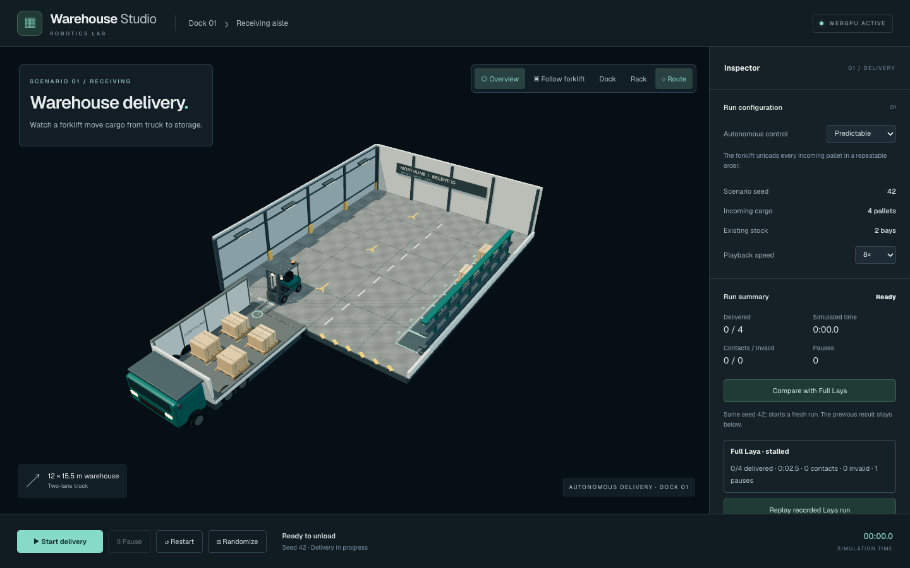
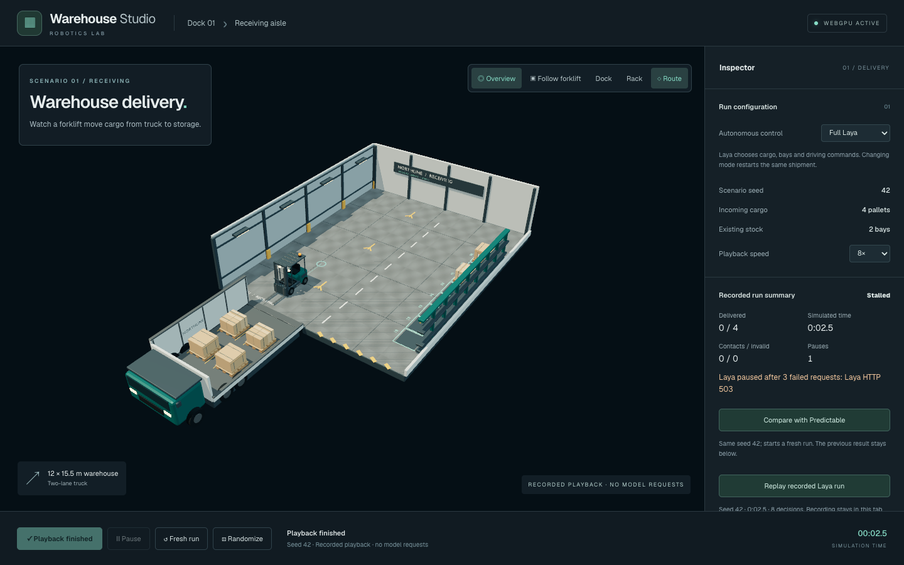
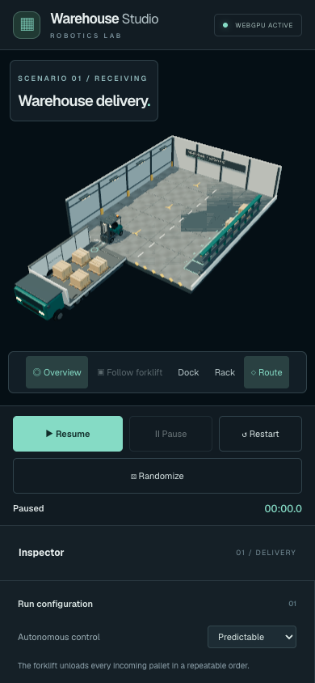
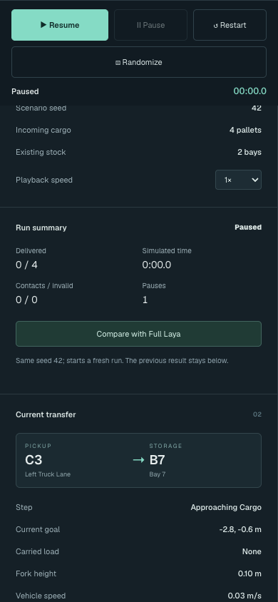

# Phase 5 review — controls, comparison and playback

Phase 5 is complete. Stop here for user review before Phase 6.

## Visitor controls

- Start/resume, pause, restart the same seed, randomize, and change autonomous mode. Mode changes restore identical initial conditions; randomization always chooses a different seed.
- The run summary reports delivered pallets, simulated time, contacts, invalid actions, pauses, outcome and any failure reason.
- **Compare with the other mode** restores the same seed and displays the previous opposite-mode result. Interrupted runs are labelled explicitly. History retains at most 12 seed/mode summaries.
- **Replay recorded Laya run** enters clearly labelled recorded playback. Start playback, pause/resume and 1×/4×/8× speed work without model requests. A finished recording can be replayed again. Restart leaves playback for a fresh run.



## What is recorded

Full Laya records the actual fixed-step world states, route, decision inspector and applied commands. Decisions include observation and response timestamps; pause markers retain the simulation time and reason. Playback reads those frames directly, preserving the forklift path, pallet transitions, events and elapsed simulation time without regenerating decisions.

Source pause counts and outcome remain visible during playback. Waiting at a visitor pause is omitted from the timeline; pausing playback does not change the recorded summary. A stalled source remains labelled stalled when playback finishes.

Recordings are in-memory and local to the tab, with one active and one latest saved recording. They are bounded by the existing 900-second simulation limit. Reloading clears them; file export/import and cross-version playback are outside this phase. Exactness refers to simulation states, not pixel-identical rendering of cosmetic animation.



## Layout, camera and lifecycle

Camera handoff synchronizes the camera and orbit target when changing views, resizing or resetting. Narrow screens show the full warehouse and place sticky transport controls directly below it. Keyboard focus is visible, occupied bays have text labels, and statuses use words as well as color. Reduced-motion preferences disable Follow, orbit damping and cargo settling animation.

Cargo label geometry and materials now dispose when removed; shared GLB assets remain cached. The browser lifecycle check cycles randomization, mode changes, start/pause/restart and cameras 16 times, asserting a single canvas, bounded GPU resources and no page errors. See [resource measurements](resources.json).





## Verification

- **35 simulation/client tests passed**, using standalone `test(...)` functions. Coverage includes stale replies, disconnects, repeated controls, summary history and offline playback.
- A complete four-pallet seed-42 trace from Phase 4 feeds the real recorded model responses into the controller. Every recorded replay frame matches the source world, with no new model calls.
- **8 browser tests passed** across the existing and new suites. The three Phase 5 browser tests passed again after final playback-label changes.
- Typecheck, production build and Biome passed. The existing large-bundle warning remains.
- A live Chrome 153 WebGPU check captured **13 real Laya decisions**, paused/resumed, then simulated a service disconnect in browser routing. Automatic failure handling paused safely. Playback ended at the same **4.6 simulated seconds**, with the request counter unchanged at **17** and no page errors. This short live check verifies recording and failure handling; the full-delivery replay is covered by the stored trace test.

See [live measurements](live-review.json) and [live recording screenshot](live-recording.png). The local Laya service was left running; the disconnect was simulated only for that browser page.

## Reproduce

From the repository root:

```sh
pnpm -C apps/warehouse-demo test
pnpm -C apps/warehouse-demo test:e2e
pnpm -C apps/warehouse-demo build
pnpm -C apps/warehouse-demo lint
```

For the optional live smoke check, start the app on port 8084 and keep Laya available through its configured proxy, then run `node scripts/warehouse-phase5/review.mjs`. This sends real model requests and writes the live review artifacts.

Phase 6 remains unstarted.
